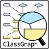

# ZupportL5 Overview

## ZupportL5 - Next Level Support Engineering

*Elevating Support Engineering to the Next Level | Simplifying Resolutions*

### **Graphical representation of the technology-stack used to implement Zupport-L5-API (alphabetically sorted)**

## Application Overview | [See implementation details](#DETAILS)

ZupportL5 is Support Engineering System designed to enhance Support beyond human capabilities.

_There are 4 levels of service in Support Engineering: L1, L2, L3, and L4. **Zupport-L5 System** aims to elevate Support Engineering beyond these levels by offering advanced solutions, automating processes, and optimizing efficiency for a next-level support experience._

### Current features include

ZupportL5 ensures that engineers, operations teams, and support staff have access to comprehensive, up-to-date resources, empowering them to efficiently collaborate, troubleshoot, and innovate.

Integration of various sources of technical documentation (wikis, knowledge bases, runbooks, etc.) into a centralized platform.

From a technological point of view, this project cover many features in the java-stack backend development, including a wide range of components and technologies for modern java-based applications, and can be easily adapted to different purposes and business requirements.

**Key features include**:

*   Incident Tracking
*   Handover Management
*   Performance Metrics
*   Integration with Dropbox services for file storage
*   Workflow to handle Knowledge-base, Playbooks and Runbooks
*   Indexing to create a source-of-truth for Support Engineering

### Goals for future version

To enhance support beyond human capabilities could bring features like predictive maintenance, automated issue resolution, intelligent troubleshooting, and real-time decision-making.

This version includes the core set of RESTful services and structural modules of the **ZupportL5-api Backend**, these modules have been designed and implemented so that the application to be adapted and extended to meet specific outcome requirements

The goals-for-future-versions include the implementation of **ZupportL5-Frontend App** as well as providing coverage for some of the User-Stories outlined in the following section.

User Stories
------------

#### 1\. Support Engineer

*   **As a** _Support Engineer_, **I want** to access a centralized knowledge base **so that** I can quickly find relevant information to resolve issues.
*   **As a** _Support Engineer_, **I want** workflow to automate runbooks to help me follow best practices for technical problems, **so that** I can resolve issues efficiently.
*   **As an** _On-call Engineer_, **I want** a streamlined handover process, **so that** I can pass on the current status of ongoing incidents to the next shift without loss of context.
*   **As a** _Support Engineer_, **I want** automated incident logs and performance metrics, **so that** I can track my actions and monitor the success of incident resolutions.
*   **As a** _Support Engineer_, **I want** to receive proactive alerts about potential issues **so that** I can address them before they impact users.
*   **As a** _Support Engineer_, **I want** to have a diagnostic tool that provides AI-driven insights **so that** I can quickly identify and resolve root causes of issues.
*   **As a** _Support Engineer_, **I want** to quickly and efficiently access historical data on similar incidents **so that** I can leverage past solutions to expedite issue resolution.

#### 2\. Product Manager

*   **As a** _As a Product Manager_, **I want** to monitor common issues and support trends via ZupportL5 **so that** I can make data-driven decisions about feature improvements.
*   **As a** _As a Product Manager_, **I want**, I want to view analytics on user-reported issues and AI-identified patterns **so that** I can prioritize development work based on customer pain points.
*   **As a** _As a Product Manager_, **I want**, I want to set up automated reporting on support metrics **so that** I can keep stakeholders informed about support performance.

#### 3\. Application User

*   **As a** _As an Application User_, **I want** to receive guidance from ZupportL5 on common issues **so that** I can solve non-technical problems on my own without waiting for support.
*   **As a** _As an Application User_, **I want** to access 24/7 support through a ZupportL5 **so that** I can get help immediately, even outside business hours.
*   **As a** _As an Application User_, **I want** to receive automatic updates when my reported issue is resolved **so that** I feel informed and confident my problem is being addressed.

#### 4\. System Engineer

*   **As a** _As a System Engineer_, **I want** to integrate ZupportL5 with our monitoring systems **so that** it can automatically detect and respond to anomalies in real time.
*   **As a** _As a System Engineer_, **I want** to receive predictive alerts from ZupportL5 about potential system failures **so that** I can prevent before it happens.
*   **As a** _As a System Engineer_, **I want** to access detailed diagnostics for system issues **so that** I can minimize the time spent identifying root causes.

#### 5\. Financial Team

*   **As a** _Financial Team Member_, **I want** to receive cost reports on support operations **so that** I can analyze and optimize numbers.
*   **As a** _Financial Team Member_, **I want** to track the financial impact of common support issues **so that** I can identify high-cost areas for potential process improvements.

## Technological Solution

ZupportL5 is built using modern Java technologies, following best practices in Software: Design, Development, Testing, and Deployment. Below are some of the core components and technologies used in the application:

This technological stack reflects the commitment to delivering a high-quality, adaptable solution that evolves with business and technical demands.

### Spring Framework

The Spring Framework is a comprehensive programming and configuration model for modern Java-based enterprise applications.

Main modules: Spring Core, Spring Data, Spring Security, Spring AOP, Spring MVC, Spring Batch, Spring Cloud

### Spring Boot

Spring Boot is a framework built on top of the Spring Framework

Spring Boot streamlines the process of building and running Spring applications, making it an ideal choice for developing microservices and RESTful APIs.

### JPA (Java Persistence API)

An abstraction layer for secure and flexible database operations. JPA decouples the application from the underlying database, enabling seamless transitions between different database systems without significant code changes.

### MySQL Database

MySQL is a widely-used, open-source relational database management system known for its reliability, scalability, and ease of use. With strong support for ACID compliance, it ensures secure and consistent data transactions.

### Spring Batch

Batch processing for handling large-scale data, used to implement application workflows; such as integration of knowledge-base, playbooks and runbooks XML files.

### Apache Maven

Build automation and dependency management tool, configured with plugins for advance execution of application processing classes to automate various application tasks.

### Dropbox API

File storage integration for uploading and managing support engineering documentation and resources.

### ClassGraph (Application-proccessing)

A powerful library for source-code scanning/reflection and bytecode analysis, enabling dynamic discovery of components and metadata within the application.

### PlantUML and Graphviz

Utilized to automate generation of UML diagrams based on application source-code to enhance code documentation and visualize system architecture.

### Spring Validation

Ensures data integrity and enforces robust validation rules within the application layers.

### JUnit 5 and Mockito

Comprehensive testing setup for unit tests, integration tests, and mocking, ensuring code reliability and coverage.

### Prometheus

Monitoring and logging integration with Micrometer Registry for real-time insights into system health.

### Xml/Json Processing with JAXB, Spring OXM, Jakarta, Fasterxml-Jackson XML and GSON

These technologies are utilized together to create a flexible and robust XML/Json data layer that can easily be modified and extended as the application evolves.

### SLF4J and Logback

SLF4J and Logback enable efficient logging at various levels.

With SLF4J and Logback the application can capture detailed logs for monitoring, debugging, and performance tracking, enhancing observability and system insight.

## Functional & Non-Functional Requirements

### Functional Requirements

*   Centralized Incident Management
*   Automated Runbook and Knowledge Base Integration
*   Defined workflow for Handover Incidents during shift transition
*   Real-time Incident Resolution Metrics
*   More to be defined in accordance with User Stories

### Non-Functional Requirements

*   Scalability for future integration with other tools and platforms
*   High Availability with cloud-native deployment options
*   Monitoring with Prometheus for system health tracking
*   Fast and reliable system performance with low latency
*   Compliance with industry standards and regulations
*   Comprehensive disaster recovery plans, including automated backups and failover mechanisms
*   Support for continuous integration/continuous deployment (CI/CD) for agile development
*   Extensibility to adapt to new business needs without significant rework
*   Detailed logging and audit trails for troubleshooting and compliance
*   Compatibility with containerization technologies like Docker/Kubernetes
*   Localized support for multiple languages and time zones
*   Ease of maintenance with self-diagnosing and self-healing mechanisms
*   Comprehensive documentation for developers and end-users
*   Interoperability with third-party APIs and systems
*   OAuth2 is implemented to access the Dropbox-API/SDK programmatically
*   ZupportL5-API must be implemented to be deployed in traditional web servers as well as a microservice.

## ZupportL5-API Diagram of Components

## ER Database Model

Explore ZupportL5-API Online | Implementation details
-----------------------------------------------------

Most of the content provided below is created during compilation or packaging phases, through the implementation of processor classes, hence the source-code, the api and the project are self-descriptive.

Version 1.0 of ZupportL5-api was deployed to Google-Cloud-Platform (GCP): **Zupport-L5-api System deployed to [google-app-engine](https://zupportl5.uc.r.appspot.com)**, whereas **Zupport-L5-api database** was deployed to **google-cloud-sql (GCS)**.

More deployment (CI/CD) MS-Github Workflows will be implemented to ensure transparent deployment in different Cloud Platforms.

*   [ZupportL5 REST-API Documentation](./ZupportL5-api-viewer.html): Provides the REST-API full standard-compliance documentation.
*   [ZupportL5 REST-API swagger style](./ZupportL5-api-swagger-doc.html): Provides the REST-API swagger-style documentation.
*   [Project Object Model Overview](./ZupportL5-api-model-overview.html): Provides information about the project dependency-artifacts.
*   [ZupportL5-api Dependency Tree](./ZupportL5-api-dependency-tree.html): Provides detailed tree-view of the application dependency-artifacts.
*   [ZupportL5-api Tree Files](./ZupportL5-api-crt-tree.html): Provides detailed tree-view of the application files.
*   [ZupportL5-api Code Metrics](./ZupportL5-api-metrics.html): Provides an internal view about code metrics.
*   [ZupportL5-api Api-docs](https://abritoh.github.io/zupportl5-api-dochub/1.0/apidocs): Java documentation of ZupportL5-api source-code.
*   [ZupportL5-api Test-Api-Docs](https://abritoh.github.io/zupportl5-api-dochub/1.0/testapidocs): Java documentation of ZupportL5-api test-code
*   [ZupportL5-api Batch Processing](/api/batch/process-xmlfiles): Provides a frontend-page to validate ZupportL5-Workflows for Batch Processing.
*   [ZupportL5-api Document Viewer](/api/documents/viewer): Provides a frontend-page to search for documents from Knowledge-base, Playbooks and Runbooks.
*   [ZupportL5-api Docker runnable-image](https://github.com/users/abritoh/packages/container/package/zupportl5-api): GitHub workflows were implemented to automate the CI/CD cycle. The url points to the runnable Docker image-container, deployed in the GitHub Container Registry.

[Goto TOP](#TOP)

© 2025 ZupportL5. All Rights Reserved.